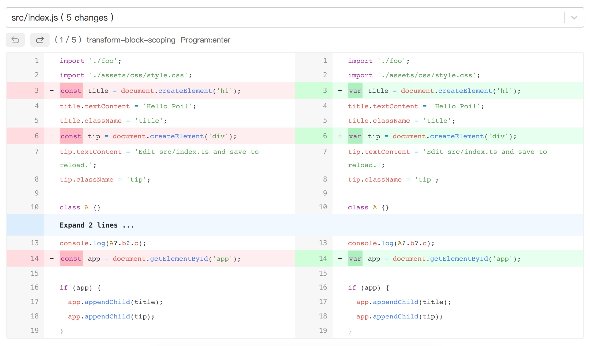
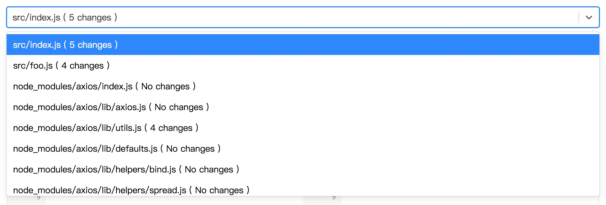

# babel-time-travel

[](https://www.npmjs.org/package/babel-time-travel)
[](https://www.npmjs.org/package/babel-time-travel)
[](https://www.npmjs.org/package/babel-time-travel)





Tell you the story about how every babel plugin transform your file inside a blackbox

## Installation

```bash
npm i babel-time-travel -g
```

## Usage

`babel-time-travel` will register a global command named `btt` after a global installation

To use it, simply add your own command after `btt`

```bash
btt npm run build
btt babel src --out-dir lib
btt ... # any other command
```

Please note

- Blackboxed `babel` should run in the same process with your command
- Files in node_modules is excluded by default for better performance

## Thanks

Highly inspired by [babel/babel-time-travel](https://github.com/babel/babel-time-travel) which supports time travel in browser

## License

MIT
